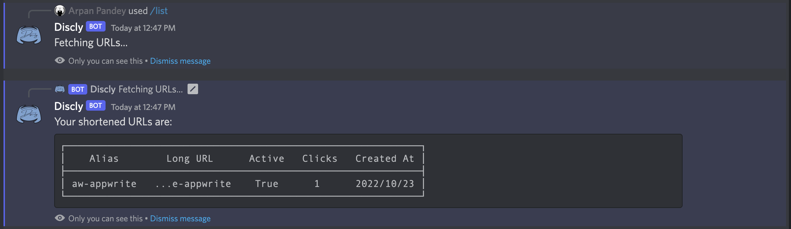

# Discordly


A Discord-bot to readily and easily shorten links from [Discord](https://discord.com) itself, made possible by [Appwrite](https://appwrite.io/).

## Installation

Install the project

```bash
  git clone https://github.com/Arpan-206/discordly.git
  cd discordly
```
    
## Environment Variables

To run this project, you will need to add the following environment variables to your .env file

- `DISCORD_BOT_TOKEN`
- `OWNER`
- `AW_PROJECT`
- `AW_ENDPOINT`
- `AW_KEY`
- `DEPLOY_URL`
- `AW_DB`
- `AW_LINKS_COLLECTION`
- `PORT`


## Deployment

To deploy this project run, after setting all the required environement variables.

```bash
  docker compose up -d
```


## Feedback

If you have any feedback, please reach out to us at [arpan@hackersreboot.tech](mailto:arpan@hackersreboot.tech).


## Authors

- [@Arpan-206](https://www.github.com/Arpan-206)


## License

[MIT](https://choosealicense.com/licenses/mit/)


## Screenshots





## Acknowledgements

 - [Appwrite](https://appwrite.io/)
 - [Discord](https://discord.com)
 - [FastAPI](https://fastapi.tiangolo.com)


## Contributing

Contributions are always welcome!

See `contributing.md` for ways to get started.

Please adhere to this project's `code of conduct`.

